# CSCE 435 Group project

## 1. Group members:
1. Jake Bergin
2. Jace Thomas
3. Cameron Hoholik-Carlson
4. Ethan McKinney

---

## Team Communication
Team communication will take place through texts and Slack.

## 2. _due 10/25_ Project topic
Sorting.

## 2. _due 10/25_ Brief project description (what algorithms will you be comparing and on what architectures)

- Merge Sort (MPI + CUDA)

  Merge sort is a comparison-based algorithm that uses a divide-and-conquer approach for sorting arrays. To make parallel, we use the sequential algorithm but scatter the array equally across multiple processes.
  
  Psuedocode (source: https://en.wikipedia.org/wiki/Merge_sort):
  ```
  function merge_sort(list m) is
    // Base case. A list of zero or one elements is sorted, by definition.
    if length of m ≤ 1 then
        return m

    // Recursive case. First, divide the list into equal-sized sublists
    // consisting of the first half and second half of the list.
    // This assumes lists start at index 0.
    var left := empty list
    var right := empty list
    for each x with index i in m do
        if i < (length of m)/2 then
            add x to left
        else
            add x to right

    // Recursively sort both sublists.
    left := merge_sort(left)
    right := merge_sort(right)

    // Then merge the now-sorted sublists.
    return merge(left, right)

  function merge(left, right) is
    var result := empty list

    while left is not empty and right is not empty do
        if first(left) ≤ first(right) then
            append first(left) to result
            left := rest(left)
        else
            append first(right) to result
            right := rest(right)

    // Either left or right may have elements left; consume them.
    // (Only one of the following loops will actually be entered.)
    while left is not empty do
        append first(left) to result
        left := rest(left)
    while right is not empty do
        append first(right) to result
        right := rest(right)
    return result

  MPI_Scatter(arr, range, MPI_INT, arr_copy, range, MPI_INT, 0, MPI_COMM_WORLD);

	merge_sort(arr_copy, 0, range - 1);

	MPI_Gather(arr_copy, range, MPI_INT, arr, range, MPI_INT, 0, MPI_COMM_WORLD);
  ```

- Odd-Even Transposition Sort (openMP + CUDA)

  Odd-Even Sort is a compare and exchange algorithm, that compares odd and even pairs, and after n phases all of the elements will be sorted, and is availabe in parallelism.

  Pseudocode (source: CSCE 435 Slide Deck "07_CSCE_435_algorithms.pdf slide 52"
  ```
  procedure ODD-EVEN_PAR (n) 
  
  begin 
     id := process's label 
  	
     for i := 1 to n do 
     begin 
  	
        if i is odd and id is odd then 
           compare-exchange_min(id + 1); 
        else 
           compare-exchange_max(id - 1);
  			
        if i is even and id is even then 
           compare-exchange_min(id + 1); 
        else 
           compare-exchange_max(id - 1);
  			
     end for
  	
  end ODD-EVEN_PAR
  ```

- Odd Even Sort (MPI)

  Pseudocode source: https://www.dcc.fc.up.pt/~ricroc/aulas/1516/cp/apontamentos/slides_sorting.pdf

  ```
  rank = process_id();
  A = initial_value();
  for (i = 0; i < N; i++) {
    if (i % 2 == 0) { // even phase
      if (rank % 2 == 0) { // even process
        recv(B, rank + 1); send(A, rank + 1);
        A = min(A,B);
    } else { // odd process
  	send(A, rank - 1); recv(B, rank - 1);
      	A = max(A,B);
    }
  } else if (rank > 0 && rank < N - 1) { // odd phase
      if (rank % 2 == 0) { // even process
	recv(B, rank - 1); send(A, rank - 1);
	A = max(A,B);
      } else { // odd process
	send(A, rank + 1); recv(B, rank + 1);
	A = min(A,B);
      }
  }

  ```
  
- Bucket Sort (MPI + CUDA)

  Bucket Sort is a sorting algorithm that splits each element into different "buckets" based on the number of elements being sorted.
  Each bucket is then sorted using insertion sort.
  After each bucket is sorted, the buckets are stitched back together into one sorted array.
  This algorithm has a time complexity of O(n^2).

  MPI Pseudocode (source: ~):
  ```
  begin procedure bucketSortMPI()
  	A : list of sortable items
  	n := length(A)
  	buckets : vector of n float arrays
    
  	MPI_Init()
  	MPI_Comm_rank(taskid)
    	MPI_Comm_size(numTasks)

    	if master then
	        // initialize data
	        initializeData(A);
	    
	        // put elements into buckets
	        for i := 0 to n-1 inclusive do
	            	buckets[n*A[i]] = A[i]
	        end for
	    
	        // send buckets to worker tasks
	        for i := 0 to numTasks-1 inclusive do
	            	MPI_Send(buckets[i])
	        end for
	  
	        // receive sorted buckets from tasks
	        for i := 0 to numTasks-1 inclusive do
	 		MPI_Recv(buckets[i])
	        end for
    
	        // stitch buckets into one sorted array
	        index := 0
	        for i := 0 to n-1 inclusive do
	 		for j := 0 to buckets[i].size()-1 inclusive do
	                	A[i] = buckets[i][j]
	                	index++
	            	end for
	        end for
	  
	        // check for correctness
	        correctnessCheck()
  
  	if worker then
	        // receive bucket from master task
	        MPI_Recv(bucket)
	        
	        // run insertion sort on bucket
	        insertionSort(bucket)
	  
	        // send bucket back to master task
	        MPI_Send(bucket)

    	// Calculate min, max, and average times
    	MPI_Reduce()

    	// Calculate times
    end procedure
```

begin procedure bucketSortCUDA()
	BLOCKS : number of blocks used for program
 	THREADS : number of threads used for program
 	
	// Initialize Array
 	A : list of sortable items
  	n := length(A)

	// Initialize Data
 	initializeData(A)

  	// Initialize Buckets
   	Buckets : 2D list of sortable items

     	// n = m
      	m := length(Buckets)
    	n := length(Buckets[])

      	// Fill buckets with null values
       	for i := 0 to n-1 inclusive do
		for j := 0 to m-1 inclusive do
  			buckets[i][j] = -1.0;
     		end for
       	end for

 	// Fill buckets with array values
  	for i := 0 to n-1 inclusive do
		for j := 0 to m-1 inclusive do
  			if buckets[n * A[i]] == -1 then
     				buckets[n * A[i]] = A[i]
	 			break;
     			end if
     		end for
       	end for

 	// Sort each bucket with insertion sort
  	insertionSort<<<BLOCKS, THREADS>>>(buckets, n)

   	// Sync with threads
    	cudaDeviceSynchronize()

      	// Stitch buckets back together
       	index : count starting at 0
       	for i := 0 to n-1 inclusive do
		for j := 0 to m-1 inclusive do
  			if buckets[i][j] == -1 then
	 			break;
     			end if

   			A[index] = buckets[i][j]
      			index++
     		end for
       	end for

 	// Check for correctness
  	correctnessCheck(A, n)
  			

end procedure
```


Quick Sort (MPI & CUDA)

  Quick Sort is a sorting algorithm that that operates in a "divide and conquer" method.
  It takes in the array of data and chooses a starting element, then sorts the array into two sides, elements that are smaller than the starting element and elements that are larger than the starting element.
  Once done, it will take the first half of thenewly ordered set of data and will choose a new starting element, then repeats the step of sorting them to the left and right of the new starting element absed on if the piece of data is smaller or larger.
  This continues until the algorithm is down to 2 elements and then works its way back up the partitioned sets of data.

  Pseudocode (source: ~):
  ```
  Quicksort(array, left, right):
  	if left < right:
  		pivot = array.at(right)
  		index = left - 1
  		for i = 1, i < right:
  			if array.at(i) <= pivot:
  				//swap values to the correct side of the partition
  				swap array.at(index) with array.at(i)

			swap array.at(index + 1) with array.at(right)
			partition = index + 1
  		//recursively sort left side of partition
  		Quicksort(array, left, partition - 1)              //for CUDA Quicksort<<1, 1>>(array, left partition - 1)
  		//recursively sort right side of partition
  		Quicksort(array, partition + 1, right)
  ```

### 2c. Evaluation plan - what and how will you measure and compare
- Varying array sizes of integers (100, 1000, 10000, 100000, 500000). (Floats for bucket sort impl).
- Strong scaling (same problem size, increase number of processors/nodes)
- Weak scaling (increase problem size, increase number of processors)
- Number of threads in a block on the GPU

Comparisons will be done between different implementations and performance for varying parameters will be examined for each.

### 4. 

Odd Even Sort:

For Odd Even Sort - CUDA, the following array sizes were used: 2^16, 2^18, 2^20, 2^22, 2^24, 2^26
and the array types: Random, Sorted, Reverse Sorted
In the lower portion of the array sizes, even as the thread counts increased, the performance increases were pretty much non-existent, 
providing minimal time decreases.  

it is not until array size 2^20 until performance increases can be visualized. Hoever, the performance gains level off fairly quickly once
512 threads is reached.

For specific values, no matter the thread count, every run time for 2^16 was under 1 second, and there were no improvements between thread counts.

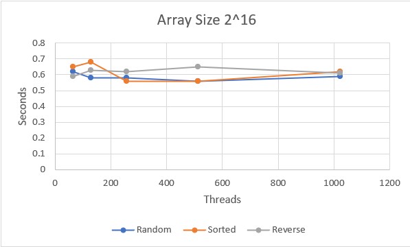

For 2^18, every run was under 3 seconds, again with no improvements or variability between array types.

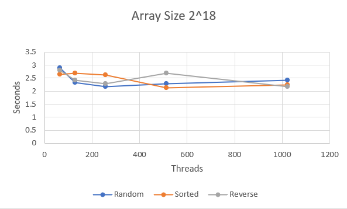

For 2^20, things began to change, there was a steep drop from 20 seconds to 14 seconds, and then to 10 seconds before leveling off. No changes between 
array types.

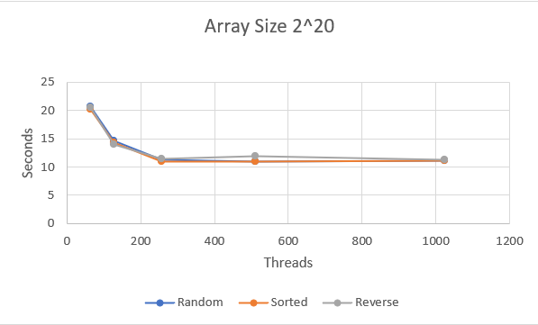

For 2^22, There was a drop from 250 seconds to 125, and then to 80. Minimal variablity, but sorted array can be seen to run quicker.For 2^24, There is a drop from 3500 seconds to 1700, and then the array types split off here. 
The random array levels off at about 1600 seconds,the sorted array levels off at about 1200 seconds. And the reverse array levels off at 1800 seconds. And actually at 1024 threads, there is a slight 
 performance decrease.

 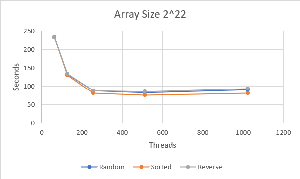

 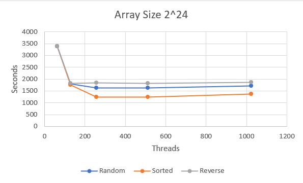


For Odd Even Sort - OMP, the following array sizes were used: 2^16, 2^18, 2^20, higher sizes were not used due to time constraints and performance drops

The OMP implementation provided some more clear observations than CUDA. The time differences and peerformance changes are much more clear. 

For array size 2^16, times decreased from threads 2 to 16, but began to increase at 64+ threads. There are clear differences in the arrays, the sorted
arrays provide the lowest times and the random times provide the highest, and reverse is in the middle.

 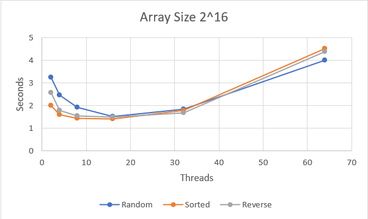

For array 2^18, the performance trends are the same as the array prior, however, as the threads increased, the performance drop off was not as severe as 
the smaller array


For array size 2^20, again the same performnce trends hold true, except the random arrays for the lower thread counts take much longer compared to the 
sorted arrays, for example the sorted array for 8 threads took 73 seconds, where the random array took 253 seconds.

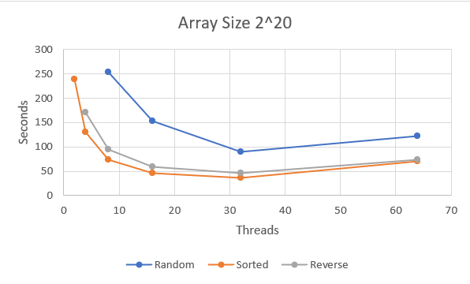

The increased time as threads get too high are due to Grace's architecture and limit of threads.

Overall, the general performance for OMP was worse compared to CUDA, however the efficiency for the threads was much greater for OMP, and visualizing
 the data was much easier and provided greater insights.
     

#### MergeSort

As the input size increases, so does the overall runtime of the program. This is an intuitive result that isn’t all that surprising. 
What is interesting is the relationship between the number of processes and ‘main’ runtime for a fixed input size. For a fixed input
size, as the number of processes increases, so does the runtime of the ‘main’ function. This is not what we had hoped to see because it
demonstrates that our program does not scale well with the number of processes. After seeing the results, I believe that this is caused
by the fact that in order for MergeSort to work, we must merge many sorted arrays. The number of processes is proportional to the
number of mergers that must be done. In this particular program, as we increase the number of processes, we are able to split the
original array into a larger number of  smaller arrays. As a result, we must spend more time merging arrays. Another interesting
observation that can be made by looking at the output graphs is the rate at which the runtime increases as the number of processes
increases. Not only does the runtime get worse as the number of processes increases, but the rate of increase seems to be higher
for larger input sizes. This can be seen in the following plots.

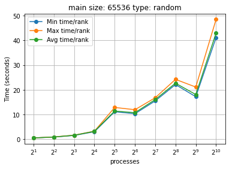
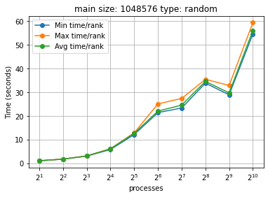
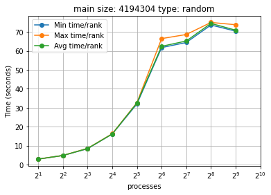


From the plots we can see that the curves are steeper for larger problem sizes. I believe this supports the idea that the increased 
amount of merging is drastically slowing down the program.

For different input types, the runtime of ‘main’ didn’t seem to be affected. The plots definitely vary between the input types, 
however the time spent within the program is approximately the same. Here are the plots used:


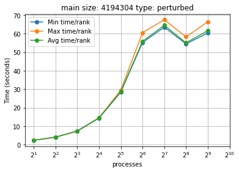
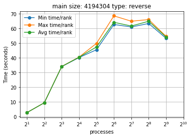
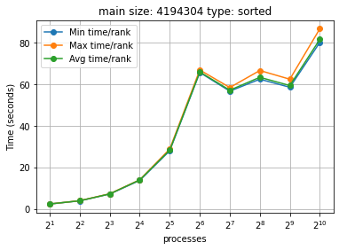

For the smaller number of processes, the curves seem to be very similar (except for the ‘reverse’ case). The peaks of the graphs 
all occur around the same 60-80 second mark near the larger number of processes. I believe that if multiple runs were performed, 
we would see an average case for all input types that is more similar. For three of the plots, the runs with 32 processes seem 
to run for around 30 seconds. However, for the ‘reverse’ case this is not true. This could be due to the fact that more swaps 
occur during the sorting phase of the program. This would increase the amount of time spent sorting each subarray.

As mentioned previously, increasing the number of processes and keeping the problem size fixed did not scale well. For this 
particular program, strong scaling does not perform well. I believe this is due to the increased number of array merges that must 
happen with an increase in processes. For weak scaling, we can look at how well the program performs when the problem size 
increases with the number of processes.

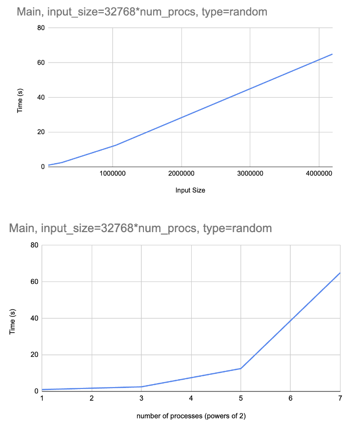

From the graph we can see a runtime that is linear with respect to the input size. For each input size, we used a number of 
processors that was directly proportional to the size of the input. The input size was divided by 32,768 to get the number of 
processors. We can determine that the program does not scale well with weak scaling. We can come to this conclusion because 
the runtime is linear (just like the relationship between the number of processors and the input size).

For CUDA: Here are the resulting plots for the ‘comp’ and ‘main’ region with weak scaling.

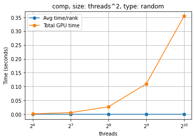
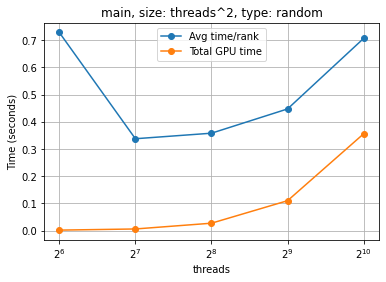

We can see that the ‘main’ portion of the program saw a decrease in the average time per rank when moving from 64 to 128 
threads. However, the ‘total GPU time’ increased uniformly as the number of threads increased. If the lines in the plots 
had been flat, we could conclude that the program has good weak scaling. In this case, we can conclude the opposite because 
the lines appear to be increasing exponentially. This shows that the program is not handling the larger problem sizes well 
even when the number of threads is increased to account for the difference. One potential issue with this test is that the 
relationship between the number of threads and problem size was not linear. For this part of the experiment, the problem 
size was equal to the number of threads squared. If instead we used a constant factor to relate the number of threads and 
the size of the input, the plots may have been flatter and suggested better weak scaling performance.


**Quicksort**
For testing the performance of our Quicksort algorithm implemented in CUDA, it was tested on a 2^16, 2^18, 2^20, 2^22, 2^24, 2^26, and 2^28 array sizes with them being sorted in order, sorted randomly, and sorted in reverse.
It was expected that as during the lower thread counts on the smaller arrays, there would not be much difference in the time, yet as the array size grew and the algorithm was run on more threads, we would theoretically see a large reduction in the time taken to complete the sorting process.
Since CUDA functions are inlined, there is no way for them to be called recursively inside of themselves. Because of this, the implementation is an attempted work around to try to run the quicksort algorithm on CUDA. 
For our implementation, it was noticeable that for the smallest array size there was virtually no difference in the runtime based on the number of threads that the program was run on. As the array size continued to grow, there was an obvious growth in the amount of time the quicksort algorithm took to finish. Along with this, there was no noticeable difference in the time the algorithm took based on the variation in the number of threads.
  
